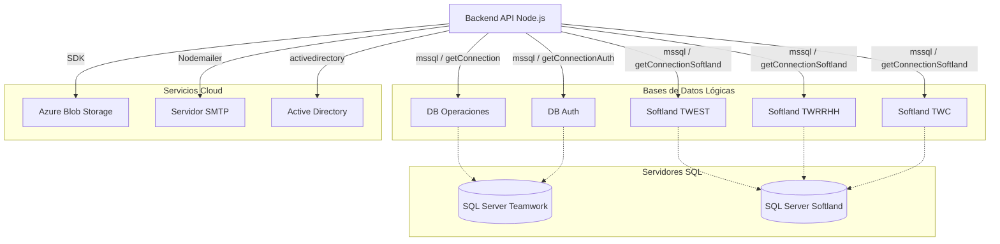

# Análisis de Conexiones y Servicios Externos

Este documento detalla todas las conexiones a bases de datos y servicios externos identificadas en el proyecto **Backend BYF**.

## 1. Bases de Datos (Microsoft SQL Server)

El proyecto utiliza el driver nativo `mssql` para interactuar con múltiples bases de datos SQL Server. La arquitectura no utiliza un ORM tradicional, sino que se basa en el manejo de conexiones directas (`ConnectionPool`), consultas SQL crudas y Stored Procedures.

### 1.1. Bases de Datos Conectadas

| Nombre Lógico | Variable Config (`config.js`) | Descripción | Uso Principal |
| :--- | :--- | :--- | :--- |
| **Teamwork (Operaciones)** | `db.operaciones` | Base de datos principal de la aplicación. | Gestión de bajas, finiquitos, estados del flujo. |
| **Auth (Seguridad)** | `dbAuth` | Base de datos de autenticación centralizada. | Usuarios, roles, resolución de tokens JWT. |
| **Softland TWEST** | `dbSoftlandTWEST` | ERP Softland (Empresa Estándar/Teamwork). | Datos de RRHH, sueldos, vacaciones. |
| **Softland TWRRHH** | `dbSoftlandTWRRHH` | ERP Softland (Empresa RRHH/Outsourcing). | Datos de RRHH, sueldos, vacaciones. |
| **Softland TWC** | `dbSoftlandTWC` | ERP Softland (Empresa Consultora). | Datos de RRHH, sueldos, vacaciones. |

### 1.2. Mecanismo de Conexión

La lógica de conexión está centralizada en `src/database/connection/index.js`.

*   **Librería**: `mssql` (v8.1.1).
*   **Pooling**: Se configuran pools de conexión con un máximo de 10 conexiones y timeout de inactividad de 60 segundos.
*   **Timeouts**:
    *   `connectionTimeout`: 30s (60s para Softland).
    *   `requestTimeout`: 30s (60s por defecto para Softland).
*   **Seguridad**: `encrypt: true`, `trustServerCertificate: true`.

#### Funciones de Conexión
*   `getConnection({ db })`: Conecta al servidor **Teamwork** usando las credenciales definidas en `config.user.teamwork`.
*   `getConnectionSoftland({ db })`: Conecta al servidor **Softland** usando credenciales específicas (`config.user.softland`).
*   `getConnectionAuth()`: Conecta a la BD **Auth** reutilizando el servidor Teamwork.

### 1.3. Patrones de Interacción con Datos

El proyecto emplea tres patrones principales para acceder a los datos:

1.  **Consultas SQL Crudas (Raw SQL)**:
    *   Definidas en archivos dentro de `src/database/scripts/` (e.g., `queriesBajas.js`).
    *   Uso intensivo de `pool.request().query(...)`.
    *   **Ejemplo**: `SELECT * FROM [cargamasiva].[View_BajasConfirmadas] ...`

2.  **Stored Procedures**:
    *   Utilizados para lógica compleja, generación de documentos y reportes.
    *   **Ejemplo**: `EXEC [finiquitos].[__PdfCarta] @idfiniquito` (Generación de PDF de carta de aviso).

3.  **Consultas Cross-Database (Softland)**:
    *   Las consultas a Softland son dinámicas e inyectan el nombre del servidor y base de datos en tiempo de ejecución.
    *   **Patrón**: `SELECT ... FROM [${server}].[${database}].[SOFTLAND].[Tabla]`.
    *   Esto permite consultar múltiples empresas (TWEST, TWRRHH, TWC) con la misma estructura de consulta.

---

## 2. Servicios Externos e Integraciones

### 2.1. Azure Blob Storage
Se utiliza para el almacenamiento de documentos generados (cartas, finiquitos) y evidencias.

*   **Archivo**: `src/services/azureblob.service.js`.
*   **Librería**: `@azure/storage-blob`.
*   **Autenticación**: `AZURE_STORAGE_CONNECTION_STRING` (Variable de entorno).
*   **Funcionalidades**:
    *   `uploadToAzure`: Carga de archivos (buffer) a un contenedor específico.
    *   `urlToDownloadToAzure`: Generación de **SAS Tokens** (Shared Access Signature) temporales (1 hora) para descarga segura de archivos.

### 2.2. Correo Electrónico (SMTP)
Servicio para el envío de notificaciones y documentos adjuntos.

*   **Archivo**: `src/services/nodemailer.service.js`.
*   **Librería**: `nodemailer` con `nodemailer-smtp-transport`.
*   **Configuración**: Define host, puerto y credenciales en `config.mail`.
*   **Seguridad**: `secure: false`, `rejectUnauthorized: false` (TLS permisivo).

### 2.3. Active Directory (LDAP)
Integración para autenticación corporativa.

*   **Configuración**: En `src/database/connection/index.js` -> `dbSettingsAD`.
*   **Librería**: `activedirectory`.
*   **Uso**: Se inicializa la conexión con `getConnectionAD()` usando `config.ldap` (URL) y `config.ldapdc`/`config.ldapdcc` (Base DN).

---

## 3. Diagrama de Conexiones

## 4. Archivos Clave de Configuración

*   `src/api/config.js`: Mapeo de variables de entorno a configuración interna.
*   `src/database/connection/index.js`: Lógica de creación de pools de conexión.
*   `src/database/scripts/`: Repositorio central de todas las consultas SQL y llamadas a SPs.
*   `.env`: (No incluido en control de versiones) Fuente de credenciales y cadenas de conexión.
