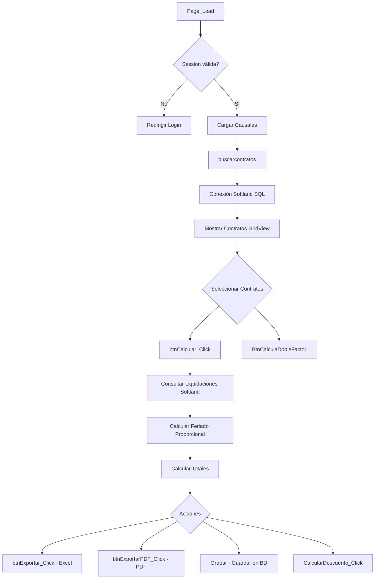

# CalculoBajaEst.aspx.cs

## Información General

| Campo | Valor |
|---|---|
| **Archivo** | `FiniquitosV2/CalculoBajaEst.aspx.cs` |
| **Namespace** | `FiniquitosV2` |
| **Clase** | `CalculoBajaEst : System.Web.UI.Page` |
| **Líneas de código** | 4211 |
| **Dependencias clave** | `System.Data.SqlClient`, `OfficeOpenXml`, `iTextSharp`, `FiniquitosV2.Clases`, `Finiquitos.Clases`, `FiniquitosV2.api` |

## Descripción Funcional

**Archivo más complejo del proyecto (4211 líneas, 53+ métodos)**. Página de cálculo de finiquitos para la empresa EST Service. Concentra toda la lógica de negocio del cálculo de liquidaciones de sueldo, incluyendo:
- Búsqueda de contratos en Softland
- Cálculo de feriado proporcional (vacaciones)
- Cálculo de indemnizaciones (IAS, desahucio, indemnización voluntaria)
- Cálculo con factor doble (contratos complejos)
- Exportación a Excel y PDF del documento de finiquito
- Grabación de resultados en la base de datos del sistema

## Arquitectura y Flujo Principal



## Métodos Principales

### Búsqueda y Carga

#### `buscarcontratos()`
- **Conexión SQL directa a Softland**:
  ```
  Data Source=conectorsoftland.team-work.cl\SQL2017;Initial Catalog=Tw_Est;User ID=Sa;Password=Softland070
  ```
- Usa `Clases.Contrato.validarPersonaExistente()` y `buscarContratos()`.
- Carga datos del trabajador: nombre, RUT, banco, número de cuenta.
- Muestra contratos en `GridView1`.

### Cálculo de Finiquitos

#### `btnCalcular_Click(object sender, EventArgs e)` (~400 líneas)
- **Lógica de negocio principal**:
  1. Valida que haya causal seleccionada y contratos chequeados.
  2. Consulta liquidaciones del trabajador en Softland:
     ```sql
     -- Vía Clases.Contrato.ObtenerLiquidaciones(connectionString)
     ```
  3. Calcula días trabajados entre fecha inicio y término del contrato.
  4. **Cálculo de Feriado Proporcional**:
     - Fórmula: `(días trabajados / 360) * 15 días` → días de feriado
     - Monto: `(promedio últimas 3 liquidaciones) / 30 * días feriado`
  5. Muestra liquidaciones en `GridView2`.
  6. Almacena resultado de cálculo en variable `Fin_Calculo = 1`.

#### `BtnCalculaDobleFactor(object sender, EventArgs e)` (~350 líneas)
- Similar a `btnCalcular_Click` pero para contratos con **factor doble**.
- Usa un `factorContrario` para cálculos con factor inverso.
- Maneja la complejidad de contratos que tienen dos factores de cálculo.

#### `CalcularDescuento_Click(object sender, EventArgs e)`
- Agrega descuentos al finiquito (haberes y descuentos adicionales).
- Itera GridView de descuentos y haberes para calcular totales.
- Actualiza labels de total finiquito.

### Grabación de Datos

#### `Grabar(object sender, EventArgs e)`
- Registra el cálculo en la base de datos del sistema.
- Llama a `svcFiniquitos.SetRegistrarCalculo()` con ~25 parámetros.
- Parámetros incluyen: idDesvinculacion, montos de cada componente, usuario, empresa.
- Valida que el cálculo esté completo (`Fin_Calculo == 1`).

### Exportación de Documentos

#### `btnExportar_Click(object sender, EventArgs e)` (~700 líneas)
- **Genera documento de finiquito en Excel** usando EPPlus (`OfficeOpenXml`).
- **Dos tipos de finiquito**:
  - Tipo 0: Contrato ≤ 30 días (finiquito simple)
  - Tipo 1: Contrato > 30 días (finiquito con indemnizaciones)
- Usa clase `Plantillas` para textos legales del documento.
- Usa clase `Convertidor` para montos en letras.
- Incluye: título, párrafos legales, tabla de haberes/descuentos, total, firmas.
- Formato de impresión configurado (márgenes, tamaño carta).

#### `btnExportarPDF_Click(object sender, EventArgs e)` (~500 líneas)
- **Genera documento de finiquito en PDF** usando iTextSharp.
- Misma estructura que Excel: título, párrafos, tabla, firmas.
- Documento descargado directamente al navegador.

### Métodos de Utilidad

| Método | Propósito |
|---|---|
| `factor(diasHabiles, factorcifra)` | Calcula factor de días hábiles × cifra |
| `InvierteDT()` | Invierte filas de DataTable (pone mes más reciente primero) |
| `validarTrabajadorFiniquito()` | Verifica si ya existe un finiquito para este trabajador |
| `replaceCharacter(string)` | Reemplaza entidades HTML por caracteres acentuados |
| `Limpiar_Click()` | Sin implementación |

## Conexiones a Base de Datos

### SQL Directo (Softland)

| Servidor | Catálogo | Credenciales | Uso |
|---|---|---|---|
| `conectorsoftland.team-work.cl\SQL2017` | `Tw_Est` | `Sa`/`Softland070` | Contratos y liquidaciones |

### WCF (Servicio Finiquitos)

| Método | Propósito |
|---|---|
| `GetCausal()` | Causales de despido |
| `SetRegistrarCalculo()` | Grabar cálculo de finiquito |
| `GetAreaNegocio()` | Obtener área de negocio del cliente |
| `GetCausalesDocumento()` | Obtener causales para documento legal |

### Clases de Negocio

| Clase | Métodos Usados |
|---|---|
| `Clases.Contrato` | `validarPersonaExistente()`, `buscarContratos()`, `ObtenerLiquidaciones()` |
| `Clases.Plantillas` | `tituloFiniquito()`, `inicioFiniquito()`, `parrafoPrimeroFiniquito()`, etc. |
| `Clases.Convertidor` | `enletras()` — número a cifra en letras |
| `Clases.Causales` | `cargarCausalDocumento()` — carga causal para documento |

## Variables de Sesión

| Variable | Uso |
|---|---|
| `Session["rut"]` | RUT del trabajador en cálculo |
| `Session["Usuario"]` | Usuario logueado |
| `Session["Tipo"]` | Rol de usuario |

## Vulnerabilidades y Observaciones

> [!CAUTION]
> **Credenciales SQL hardcodeadas** en múltiples métodos — mismas credenciales `Sa`/`Softland070`.

> [!CAUTION]
> **Archivo monolítico de 4211 líneas** — extremadamente difícil de mantener. Mezcla la lógica de cálculo, presentación y exportación en una sola clase.

> [!WARNING]
> **Lógica de negocio crítica en code-behind**: Los cálculos de finiquito están en el code-behind de la UI en lugar de en una capa de negocio separada. Debería estar en clases de servicio independientes.

> [!WARNING]
> **Thread.Sleep(1000)** en `BtnCalculaDobleFactor` — pausa artificial sin propósito aparente.

> [!WARNING]
> **Código duplicado masivo**: Los métodos de cálculo, exportación Excel y PDF tienen segmentos muy similares entre los tipos de finiquito (0 y 1). Debería refactorizarse con un patrón de estrategia.

> [!NOTE]
> La clase `Plantillas` centraliza los textos legales del finiquito, lo cual es una buena práctica. Permite cambiar textos sin modificar el code-behind.
