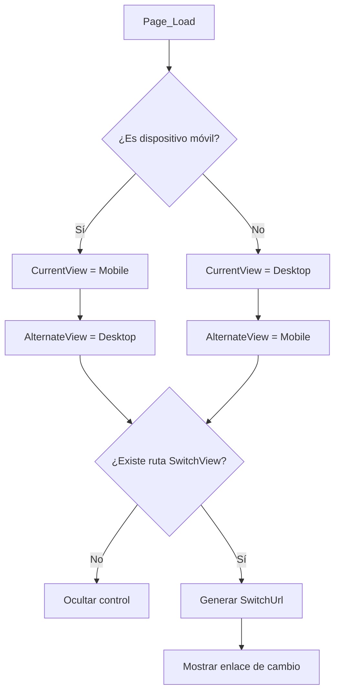

# ViewSwitcher.ascx.cs

## Información General

| Campo | Valor |
|---|---|
| **Archivo** | `FiniquitosV2/ViewSwitcher.ascx.cs` |
| **Namespace** | `FiniquitosV2` |
| **Clase** | `ViewSwitcher : System.Web.UI.UserControl` (partial) |
| **Líneas de código** | 43 |
| **Dependencias clave** | `System.Web.Routing`, `Microsoft.AspNet.FriendlyUrls.Resolvers` |

## Descripción Funcional

**User Control** de ASP.NET que implementa el **cambio de vista Mobile/Desktop**. Es un componente de UI reutilizable (`.ascx`) que detecta si el dispositivo es móvil y ofrece un enlace para cambiar entre las vistas Mobile y Desktop. Utiliza el sistema de **FriendlyUrls** de ASP.NET.

## Propiedades

| Propiedad | Acceso | Tipo | Descripción |
|---|---|---|---|
| `CurrentView` | `protected get; private set` | `string` | Vista actual: `"Mobile"` o `"Desktop"` |
| `AlternateView` | `protected get; private set` | `string` | Vista alternativa para cambiar |
| `SwitchUrl` | `protected get; private set` | `string` | URL para cambiar de vista |

## Métodos

### `Page_Load(object sender, EventArgs e)`
- **Lógica**:
  1. **Detecta dispositivo**: Usa `WebFormsFriendlyUrlResolver.IsMobileView()` para determinar si el usuario está en un dispositivo móvil.
  2. **Establece vistas**: Asigna `CurrentView` y `AlternateView` según el tipo de dispositivo.
  3. **Genera URL de cambio**: Construye la URL de cambio de vista usando la ruta registrada `AspNet.FriendlyUrls.SwitchView`.
     - Formato: `~/__FriendlyUrls_SwitchView/{view}?ReturnUrl={pagina_actual}`
  4. **Fallback**: Si la ruta `AspNet.FriendlyUrls.SwitchView` no existe (FriendlyUrls no habilitado), oculta el control (`this.Visible = false`).

## Dependencias Externas

| Paquete NuGet | Clase Usada | Propósito |
|---|---|---|
| `Microsoft.AspNet.FriendlyUrls` | `WebFormsFriendlyUrlResolver` | Detección de dispositivo móvil |
| `System.Web.Routing` | `RouteTable` | Acceso a rutas registradas |

## Flujo de Detección

## Observaciones

> [!NOTE]
> Este es un componente **estándar de plantilla** generado automáticamente por Visual Studio al crear un proyecto ASP.NET Web Forms con Mobile support. No contiene lógica de negocio custom.

> [!NOTE]
> El control se incluye en las páginas maestras (`.master`) para mostrar el enlace "Ver versión Desktop/Mobile" en la parte inferior de la página. La funcionalidad depende de que `FriendlyUrls` esté registrado en `RouteConfig`.

> [!TIP]
> Si la aplicación no necesita soporte de vistas separadas Mobile/Desktop (diseño responsive reemplaza esta funcionalidad), este control puede eliminarse sin impacto en la lógica de negocio.
