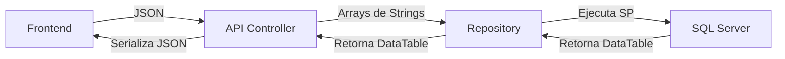

# Análisis Integral del Proyecto ApiTeamwork

## 1. Visión General del Proyecto
**Nombre**: ApiTeamwork
**Tipo**: Aplicación ASP.NET Web API 2
**Framework**: .NET Framework 4.5
**Propósito**: API Backend para gestión de Recursos Humanos, enfocada en Finiquitos, Remuneraciones (Cargo Mod) y Finanzas.

## 2. Arquitectura Técnica
El proyecto sigue una arquitectura de 3 capas con un estilo de implementación "Legacy" basado en procedimientos almacenados.

### Estructura de la Solución
1.  **Teamwork.Api**: Capa de presentación (Controllers). Actúa como un "Wrapper" o pasarela HTTP.
2.  **Teamwork.Repository**: Capa de acceso a datos. Usa ADO.NET puro (`SqlClient`).
3.  **Teamwork.Model**: Objetos de transferencia de datos (DTOs).

### Diagrama de Flujo de Datos

### Stack Tecnológico
*   **Lenguaje**: C#
*   **Web Framework**: ASP.NET Web API 2
*   **Serialización**: Newtonsoft.Json (v11)
*   **Base de Datos**: SQL Server (Acceso vía Stored Procedures)
*   **Autenticación**: JWT con `TokenValidationHandler`.

---

## 3. Análisis Detallado de Módulos

### 3.1. Módulo de Finanzas
**Responsabilidad**: Gestión de valores monetarios diarios ("Valor Diario") para cálculos de facturación o nómina.

*   **Controlador**: `FinanzasController`
*   **Repositorio**: `FinanzasRepository`
*   **Procedimiento Principal**: `finanzas.package_FZ_ValorDiario`

**Funcionalidad**:
Operaciones CRUD básicas controladas por el parámetro `@ACCION`:
*   `Crear`, `Listar`, `Actualizar`, `Eliminar`.
*   Los valores se asocian a una triada: **Cliente - CargoMod - Empresa**.

### 3.2. Módulo de Finiquitos (Terminación de Contrato)
**Responsabilidad**: Ciclo de vida completo del término de la relación laboral, desde la simulación del cálculo hasta el pago y firma legal.

*   **Controlador**: `FiniquitosController`
*   **Repositorio**: `CallExecutionAPI` (Wrapper genérico)
*   **Procedimiento Principal**: `package.__Finiquitos` (God Object en base de datos)

**Flujos Críticos**:
1.  **Cálculo y Simulación**:
    *   Endpoints: `ConsultaSimulaciones`, `ConsultaFiniquitos`.
    *   Permite previsualizar montos antes de oficializar.
2.  **Gestión de Complementos**:
    *   Agregar haberes o descuentos adicionales al finiquito (`ComplementoAgregarHaber`, `ComplementoAgregarDescuento`).
3.  **Flujo Logístico y Legal**:
    *   Gestión de envíos a notaría y regiones (`GestionEnvioRegiones`, `GestionEnvioLegalizacion`).
    *   Recepción de documentos firmados (`GestionRecepcion...`).
    *   Firma final del finiquito (`FirmarFiniquito`, `TerminarFiniquito`).
4.  **Flujo de Pago**:
    *   Solicitud de pago vía Transferencia (TEF), Vale Vista o Cheque.
    *   Validación por Finanzas (`ValidarFinanzas`) y ejecución del pago (`PagarFiniquito`).

**Puntos de Dolor**:
*   Alta complejidad centralizada en un único SP (`package.__Finiquitos`).
*   Múltiples endpoints para reversar estados (`RevertirValidacion`, `RevertirConfirmacion`, etc.), indicando un flujo de estados complejo y propenso a errores humanos.

### 3.3. Módulo Cargo Mod (Modificación de Cargos)
**Responsabilidad**: Sistema de solicitud y configuración de nuevos cargos o puestos de trabajo, definiendo su estructura salarial y contractual. Actúa como puente entre Operaciones y el ERP (Softland).

**Componentes**:
Se divide en dos controladores:

#### A. OperacionesController (`operaciones/CargoMod/...`)
Gestiona el flujo de negocio y la definición del cargo.
*   **Procedimiento**: `remuneraciones.package_RM_CargoMod` y auxiliares (`_Bonos`, `_ANI`, `_ProvMargen`).
*   **Capacidades**:
    *   **Ciclo de Vida**: Crear solicitud, validar etapa (`ValidaStageActual`), cambiar estado.
    *   **Configuración Económica**: Definir sueldo base (`ActualizaSueldo`), Gratificaciones, Bonos y Márgenes.
    *   **Estructura**: Definir horarios, jornadas y días laborales.

#### B. SoftlandController (`softland/CargoMod/...`)
Gestiona la persistencia o sincronización con el maestro de cargos del ERP.
*   **Procedimiento**: `dbo.package_TW_CargoMod`
*   **Acciones**: Crear/Actualizar códigos y glosas en las tablas espejo o directas de Softland.

---

## 4. Diccionario de Datos y Procedimientos Clave

| Módulo | Procedimiento Almacenado | Descripción |
| :--- | :--- | :--- |
| **Finanzas** | `finanzas.package_FZ_ValorDiario` | CRUD de valores diarios. |
| **Finiquitos** | `package.__Finiquitos` | "God SP" que maneja toda la lógica de finiquitos (Cálculo, Flujo, Pagos). |
| **Cargo Mod** | `remuneraciones.package_RM_CargoMod` | Gestión de solicitudes y ficha del cargo. |
| **Cargo Mod** | `remuneraciones.package_RM_Bonos` | Gestión de bonos asociados a un cargo. |
| **Cargo Mod** | `remuneraciones.package_RM_ProvMargen` | Configuración de provisiones y márgenes. |
| **Generales** | `dbo.package_TW_CargoMod` | Integración con Softland (persistencia de cargos). |

## 5. Observaciones Finales y Deuda Técnica

1.  **Dependencia de Stored Procedures**: La aplicación es esencialmente una UI sobre lógica de base de datos compleja. Esto dificulta el versionado de la lógica y la realización de pruebas unitarias en C#.
2.  **Tipado Débil ("Stringly Typed")**:
    *   Los controladores arman arreglos de strings (`string[] param`, `string[] values`) manualmente para pasarlos a los SPs.
    *   Esto es extremadamente frágil: un cambio en el orden de los parámetros en el SP romperá la API sin aviso de compilación.
    *   Los modelos (`DataPackage...`) usan `string` para casi todos los campos (fechas, montos, enteros), delegando el parseo a SQL Server.
3.  **Seguridad**:
    *   Queries dinámicas o lógica compleja dentro de SPs podrían ocultar vulnerabilidades si no se manejan bien los inputs.
    *   Exponer `DataTable` directamente en el JSON de respuesta revela la estructura de la base de datos al cliente.
4.  **Mantenibilidad**:
    *   El módulo de **Finiquitos** es un punto crítico debido a su tamaño y la centralización en un solo procedimiento almacenado.
    *   Cualquier cambio en la lógica de cálculo de finiquitos requiere modificar el SP `package.__Finiquitos`, con alto riesgo de regresión en otras funcionalidades que dependen del mismo SP.
